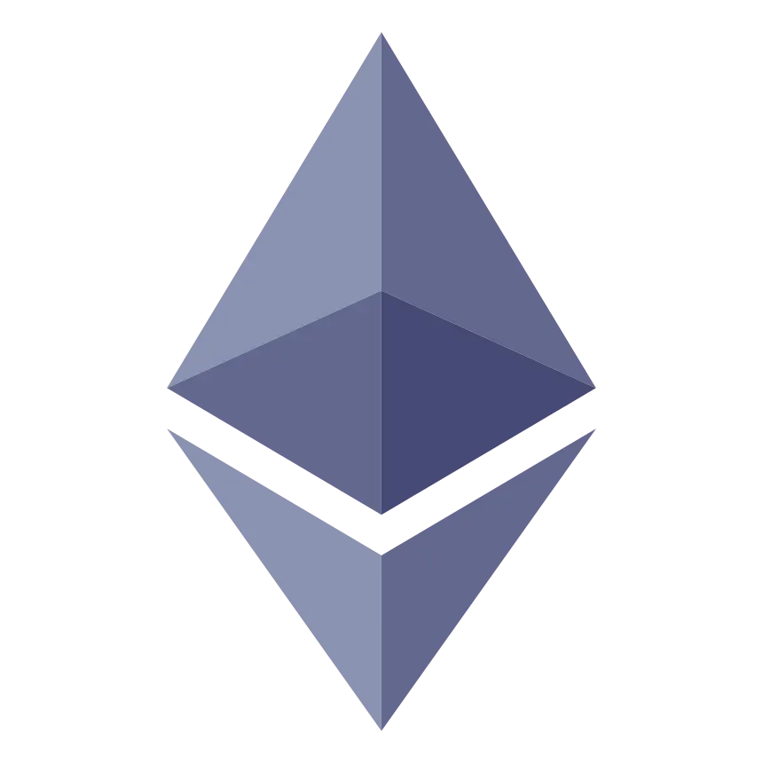
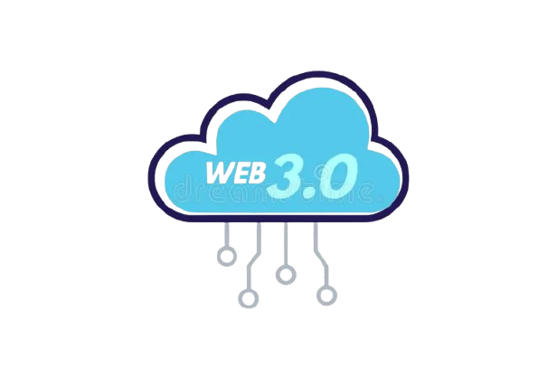
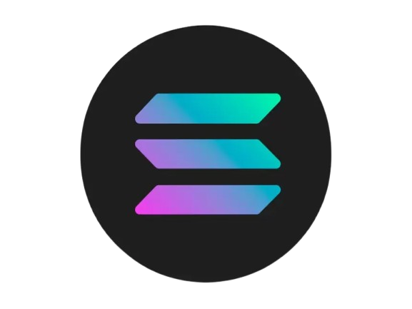
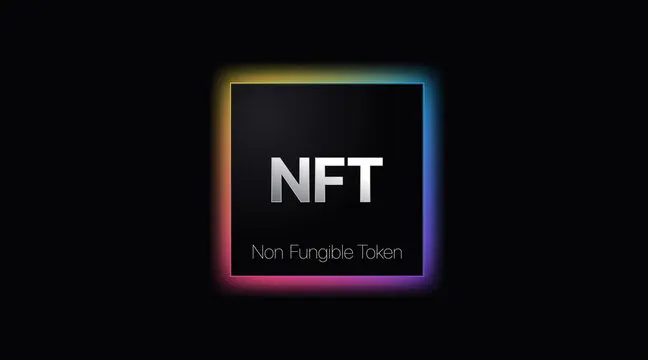
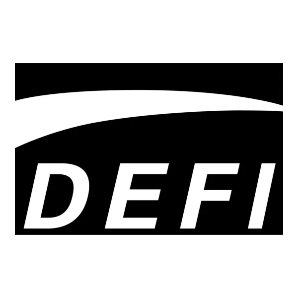

<h1 align="center">Hey there, I'm Divyansh Patel 👋</h1>
<h3 align="center">🚀 Full-Stack Developer | 🧠 Web 3.0 Enthusiast | 🦄 NFT & DeFi Believer</h3>

  

---

### 🧬 About Me

I'm Divyansh Patel — a passionate full-stack Web 3.0 developer shaping the decentralized future of the internet. From NFTs and DeFi to smart contracts and DAOs, I'm all about building trustless systems using modern web technologies and blockchain protocols. Let's break the chains of centralization together!

### 🛠️ My Tech Arsenal

  
  
  
  
  
  
  
  
  

### 🔗 Web3 Stack

  
  
  
  
  
  
  
  
  
  

### 📊 GitHub Stats

<table style="border: none; border-collapse: collapse;">
  <tr>
    <td colspan="2" align="center" style="border: none;">
      
    </td>
  </tr>
  <tr>
    <td align="center" style="border: none;">
      
    </td>
    <td align="center" style="border: none;">
      
    </td>
  </tr>
</table>

### 👾 Pacman Contribution Graph

  

### 🌐 Let’s Connect

  
  
  

- 💬 I'm open to collaborations, freelance gigs, or talking DeFi and smart contract architectures.
